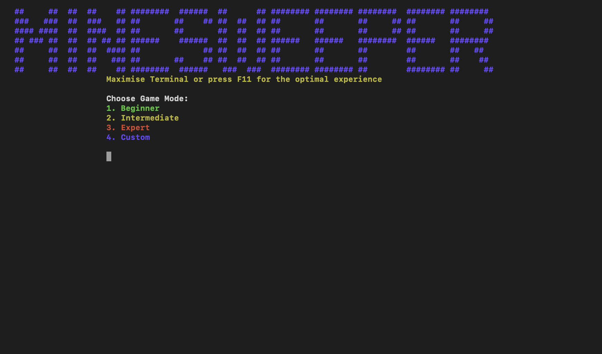
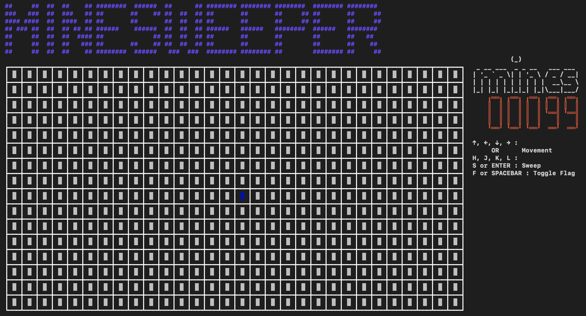
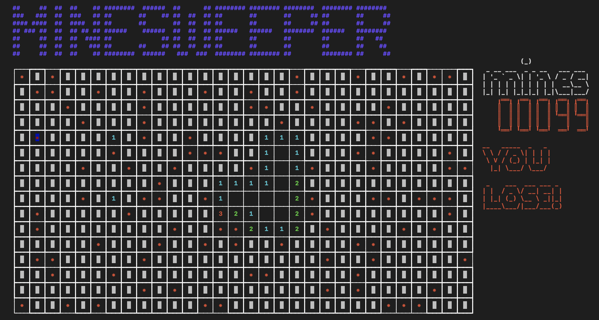

# Flag on Mine

Historically famous game, Minesweeper, is now available to play on your terminal.

## Requirements and Compiling

* g++ compiler
* C++14

<h4> To compile: </h4>

> make

<h4> To play: </h4>

> ./minesweeper

## Gameplay

| Key | Action |
| ----------------- | -------------  |
| <kbd>Left</kbd>   | Move Left      |
| <kbd>Right</kbd>  | Move Right     |
| <kbd>Up</kbd>     | Move Up        |
| <kbd>Down</kbd>   | Move Down      |
| <kbd>F</kbd>      | Put a Flag     |
| <kbd>S</kbd>      | Sweep the Cell |

* You can also see the gameplay on the game screen, there are other options but primarily this keys are enough to play.

## Difficulty Levels

| Level | # Mines | Size |
| ------ | -----  | ----- |
| Beginner  | 10   | 9x9 |
| Intermediate  | 40  | 16x16 |
| Expert    | 99  | 16x30 |
| Custom  |  ?  | ? |

## Game Screen

| Select Difficulty | Start Game | Game Over |
| ------ | -----  | ----- |
|   |    |  |